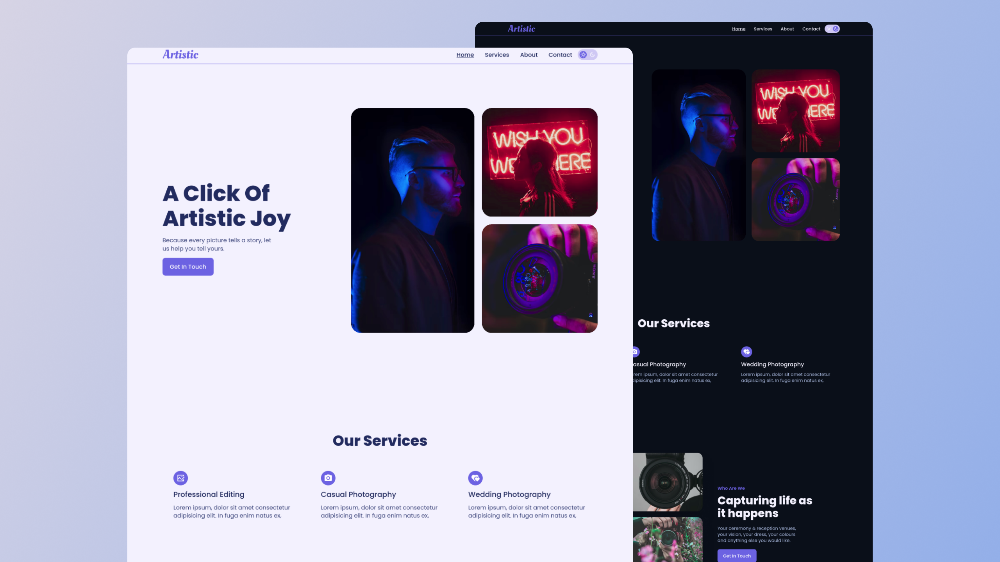

# Artistic 📸

Made with ❤️ by [Shaif Arfan](http://instagram.com/shaifarfan08/)

**Live preview: [https://wc-artistic.netlify.app/](https://wc-artistic.netlify.app/)**

**Watch on YouTube: Coming Soon**

---

## Project Description

Artistic is a landing page for a photography studio. This is a well-designed and `responsive` landing page with `dark mode` feature. The main purpose of this project is to show how to create a landing page with `dark mode` feature using `ReactJs`.
We will be using React Context API to toggle `dark mode` feature. Hope you enjoy it!.

## What we are going to learn/use

- [ReactJs](https://reactjs.org/)
- [Styled Components](https://styled-components.com/)
- [React Context API](https://reactjs.org/docs/context.html)
- [React Hooks](https://reactjs.org/docs/hooks-intro.html)
- [React Icons](https://www.npmjs.com/package/react-icons)
- [React Scroll](https://www.npmjs.com/package/react-scroll)
- More . . .

## Requirements

- Basic ReactJs knowledge
- Basic HTML, CSS knowledge

## Starter files

You can find all the starter files in `starter-files` branch. You can to go to the `starter-files` branch and `download zip` the the starter files or You can clone the project and git checkout to `starter-files` branch.

## Getting Started

The recommended way to get started with the project is Follow the [YouTube tutorial][youtubelink]. You will find all the step-by-step guides. Or you Can start the project on your own by following the guide below.

After getting the starter files, you need to go the file directory and run

```shell
npm install
```

and after that start the dev server.

```shell
npm start
```

## Tools Used

1. Images: [Unsplash](https://unsplash.com/)
1. UI Design: [Figma](https://www.figma.com/)
1. Code Editor: [VS Code](https://code.visualstudio.com/)

## Similar Projects

Here are some Similar projects that you might be interested.

- [Ayan's Portfolio - React JS Project](https://github.com/ShaifArfan/AYANs-portfolio)
- [Shaif's Cuisine - HTML, CSS project](https://github.com/ShaifArfan/shaif-s-cuisine)
- [Amy's Portfolio - HTML, CSS Project](https://github.com/ShaifArfan/AMYs-Portfolio)

---

## FAQ

### Q: How can i get started?

You can get started by following the YouTube tutorial of this project. Here is the full tutorial video link: [coming soon].

### Q: What i need to start the project?

Just open your favorite code editor and follow along with the `YouTube Tutorial`[coming soon].

### Q: Who the project is for?

The project is for the people who wanna get more skilled in `ReactJs`.

---

## Feedback

If you have any feedback, please reach out to us at [@web_cifar](http://instagram.com/web_cifar)

## Support

For support, join our [Community Group](http://facebook.com/groups/webcifar).

## License

[MIT](https://choosealicense.com/licenses/mit/)

Happy Coding! 🚀
